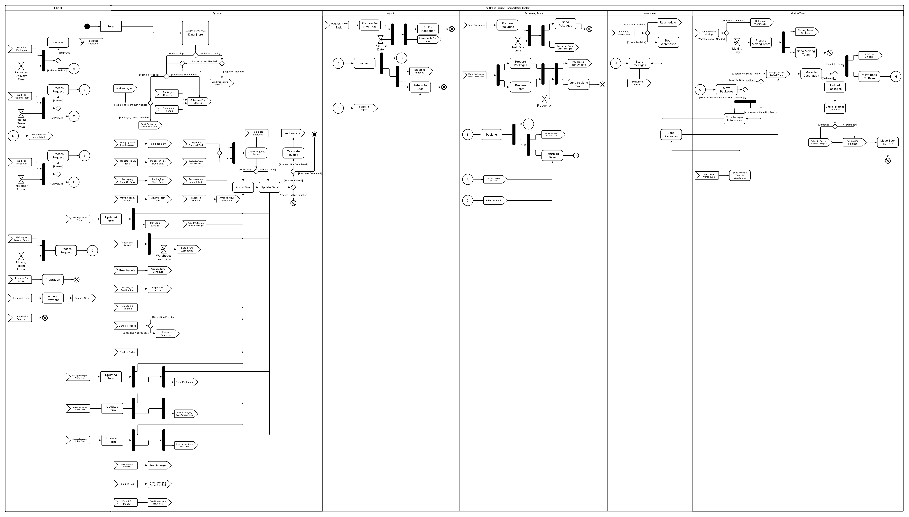
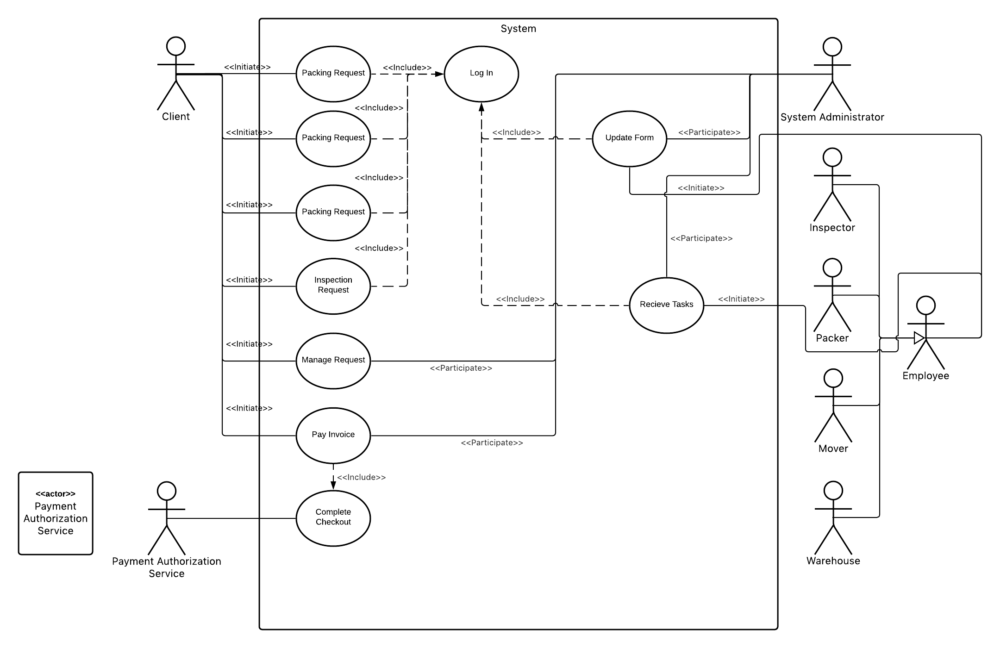
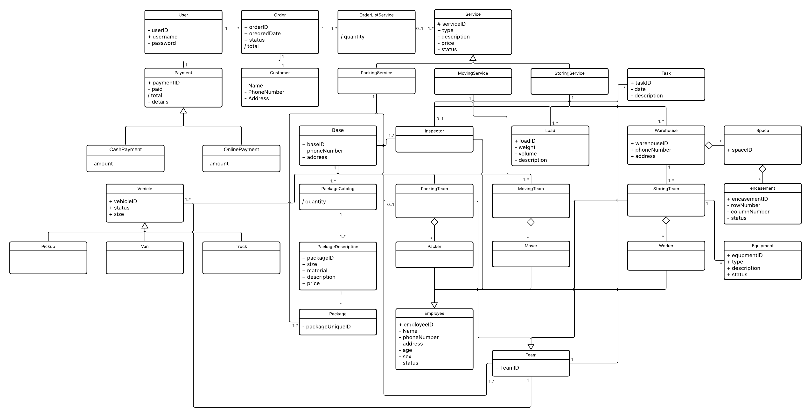
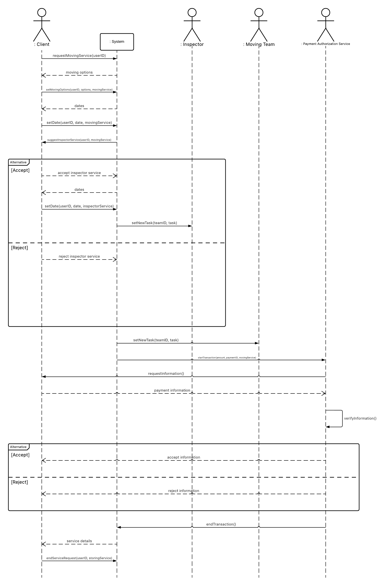
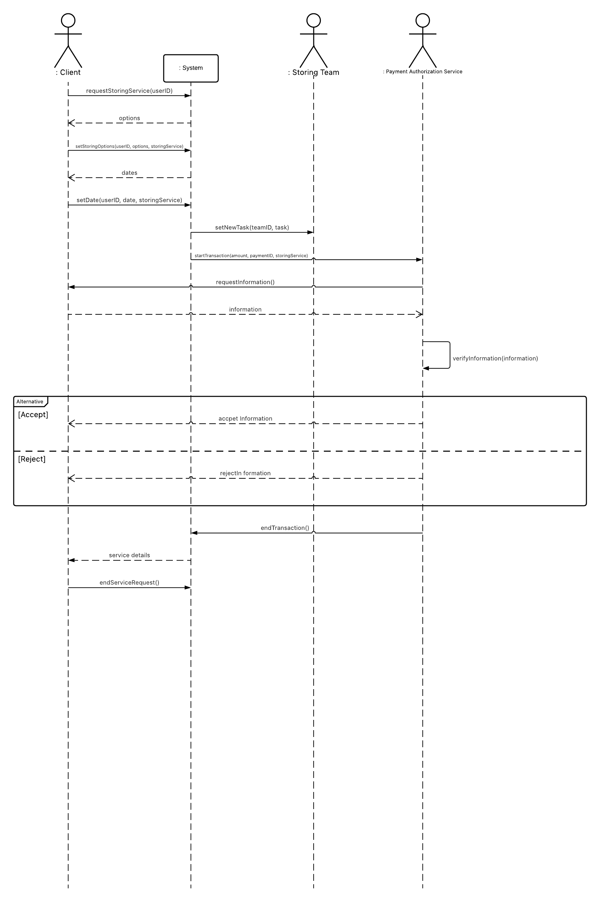
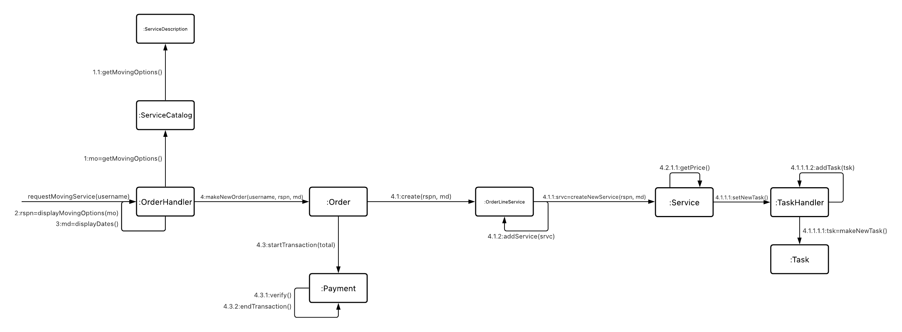
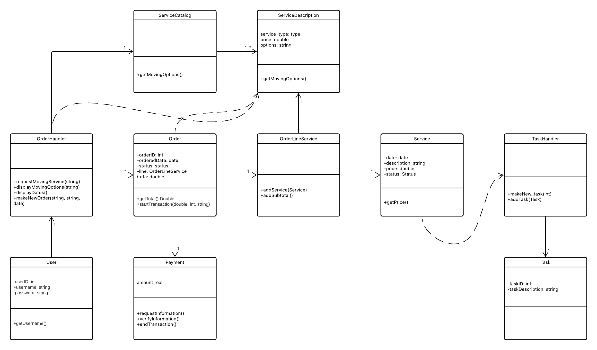

# The Online Freight Transportation System

The Online Freight Transportation System is a set of related software programs and/or services that are sold as a single package. (an IT solution)  It offers Packaging, Warehouse, Inspection and Business Moving besides basic servises.

- [The Online Freight Transportation System](#the-online-freight-transportation-system)
  - [Project Phase](#project-phase)
    - [Phase 1 (Activity Diagram)](#phase-1-activity-diagram)
    - [Phase 2 (Use Case)](#phase-2-use-case)
    - [Phase 3](#phase-3)
      - [Domain Model](#domain-model)
      - [Moving Request-System Sequence Diagram](#moving-request-system-sequence-diagram)
      - [Storing Request-System Sequence Diagram](#storing-request-system-sequence-diagram)
    - [Phase 4](#phase-4)
      - [Communication Diagram](#communication-diagram)
      - [Class Diagram](#class-diagram)

## Project Phase

### Phase 1 (Activity Diagram)

### Phase 2 (Use Case)

### Phase 3

#### Domain Model

#### Moving Request-System Sequence Diagram

#### Storing Request-System Sequence Diagram

### Phase 4

#### Communication Diagram

#### Class Diagram

